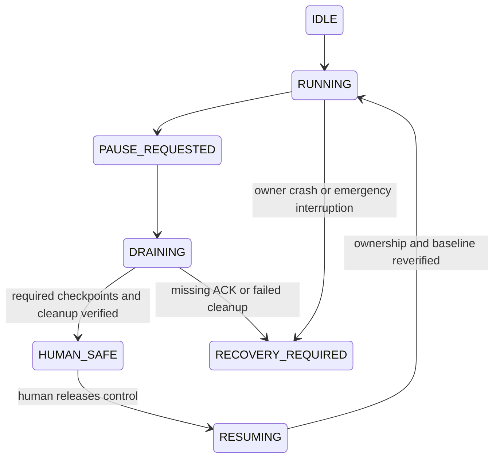

# Design protocol

## Generic core and project adapters

The core provides role contracts, task dependencies, file mail, session provenance, bounded memory,
usage/context checkpoints, worktree isolation, machine ownership, graceful handoff, recovery and
notifications. A project adapter supplies its objective, constraints, tools, test/capture contracts,
resource budgets, safe boundaries, cleanup witnesses and evidence acceptance rules. It can be a
software project, research program or another task with observable deliverables.

Terminal color/order is a human convenience, not identity. Bind each role to provider, session ID,
workspace and terminal identity. Tools differ: native JSONL, SQLite, exported JSON or protobuf all
need format-aware adapters. An unsupported provider must be explicit. Do not invent a universal
JSONL transcript or export inaccessible system/private reasoning.

## Roles

| Role | Owns | Default operational boundary |
|---|---|---|
| Supervisor | Intent, planning, assignment, acceptance, integration, budgets and recovery | Sees bounded role state; retrieves original evidence when needed |
| Executor | Implementation and verification | Separate checkout; only assigned writes and resources |
| Evaluator/advisor | Alternative explanations, reproducibility advice and independent review | Read-only source review; separate assigned output |
| Curator/researcher | Capture, retrieval, checkpoints, source research and efficiency findings | Read-only native sources; private archive; sanitized retrieval |
| Human | Priorities, timeline, intervention and emergency control | Mail and recovery terminal; safe screen handoff |

The user chooses model restrictions per role. A worked example can require unchanged-or-higher
supervisor/executor models, highest available curator model and task-dependent advisor selection.
Do not bake one vendor, model name, billing plan or operating system into the reusable contract.

## Dispatch and ownership

Task packets specify inputs and hashes, owner, baseline, writes, dependencies, limits, acceptance,
source paths and safe stop. Run independent tasks in parallel when their write/resource scopes do
not conflict. Serially resolve dependent tasks, contested files, merges and global machine state.
Any external effects need the project's consent and budget policy, not implied authority from
receiving a message. The supervisor accepts evidence-backed deliveries before integration.

A renewable lease covers GUI and global network state when those are used. Record owner/session,
task, phase, expiry and cleanup contract. Expiry prevents new action but does not establish that
an old process stopped. A worktree is file isolation, not isolation of routing, ports or the screen.

## File mail and active supervision

Record a direct terminal instruction verbatim before submitting it; route the same ID through file
mail. Verify target identity visually or programmatically and confirm delivery from native records
or an ACK. Do not impersonate the human or erase an unsubmitted human draft. Reconcile duplicate
transports by message ID. Heartbeat state distinguishes watcher health, message event, delivery,
agent activity and ACK. Provider wake/queue capability needs its own proof; a watcher alone does
not make an idle LLM act. Cheap local heartbeats should not trigger repetitive model calls.

## Memory and compaction

Keep original available records in a private, fidelity-labeled archive. Hash source and derivative
independently. Preserve previous captures on truncation, rotation or invalid-tail errors. Incremental
capture needs consistent native snapshots and source watermarks. SQLite requires consistency and
WAL handling, not blindly copying one file during writes. Search redacted derivatives with source
record pointers; optional Markdown does not replace native evidence.

Before voluntary compaction: safe phase boundary, captured source, task checkpoint, requirement
pointers and supervisor/curator ACK. After compaction: reconcile role, pending work, reservations,
ownership and source state. Observe native automatic compaction too; its timing cannot be assumed
fully controllable. Never delete contradictory history to make memory easier.

## Human handoff panel

Small always-visible non-focus-stealing native panel, with task, owner, freshness, capture health,
warnings and Request computer / Message / priorities controls. Requests are durable events.

Block new dispatches during drain; complete the current bounded action, preserve evidence,
checkpoint active roles and verify project-specific cleanup. ETA is an uncertainty-labeled range,
not an automatic permission countdown. Emergency interruption is a distinct control and marks
the task interrupted. User interference is investigated against evidence and repaired honestly.

## Notifications

Optional outgoing summaries use configured private destinations and immutable repository links.
Inbound mail becomes private human-inbox evidence, deduplicated and sanitized. Authenticate
webhook transport and separately authenticate human authority before executing an action.
No shell commands from arbitrary email. Use a dedicated receiving address rather than replacing
an existing email domain's routing. Polling is an alternative when supported by the provider.

## Research claims

The proposed division of labor is a hypothesis about efficiency, not a finding. Measure total
usage/cost, elapsed time, rework, acceptance quality, missing requirements and human intervention
against comparable task batches. Report provider/plan differences and setup overhead. Journal
proposals and tested capabilities separately. A case study is not proof of universal improvement.
